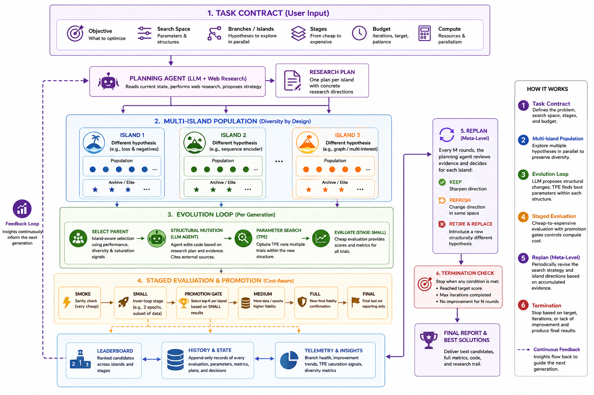

# ml-evolve-skill

> **The first ML optimization framework for industry level task built on AlphaEvolve's paradigm** — a domain-agnostic, industrial-grade algorithm self-optimization engine that evolves ML algorithms autonomously, not just searches hyperparameters.
>
> **⚡ Zero config, runs on first try** — ml-evolve is a drop-in skill for **Claude Code, Codex, and Cursor**. Write one YAML file, or just natural language, invoke the skill. No Docker, no cloud services, no credential chains. It just runs.
>
> **🧠 Multi-agent by design** — combines Claude's three-agent orchestration (Plan Agent researches papers, Mutation Agent edits code, Parameter Agent tunes parameters) into a single self-improving loop.

ml-evolve inherits **AlphaEvolve / OpenEvolve's multi-island evolutionary architecture** and applies it to the ML engineering practice, with three deliberate optimizations that make it production-ready:

| Optimization | What it solves |
|---|---|
| **Parameter search decoupling** | Claude mutates architecture; Optuna TPE handles parameter sweeps. The two search levels don't compete — each uses the right tool, improving compute efficiency by ~10× over LLM-tunes-everything. |
| **Algorithm research planning** | A plan agent researches recent papers (conferences, tech blogs, Kaggle) and writes grounded hypotheses per island. Mutations are required to cite sources — no drift to stale training-data priors. |
| **Exploration acceleration** | Multi-island branching with retire/refresh prunes dead ends and injects fresh directions. Stage promotion (`small` → `medium` → `final`) spends expensive evaluations only on survivors. |

Unlike academic research frameworks, ml-evolve is built for **industrial deployment**: every prompt is a file on disk (fully auditable), state is serialized and resumable across machines, and the entire skill body is domain-free — swap `task_spec.yaml` + `evaluator.py` and the same loop works for retrieval, ranking, tabular, RL, prompt programs, or schedulers.

> Compared to Karpathy's AutoResearch (a single-stream, single-domain experiment loop for LLM pre-training), ml-evolve inherits AlphaEvolve's **multi-island population with structured replan**, adds **TPE-based parameter optimization** and **mandatory web-research grounding**, and generalizes from one domain to any ML problem with a scalar evaluator.

`ml-evolve` runs an **architecture × parameter** search loop over your code:

- **Architecture search** is performed by Claude (web-research-grounded
  mutations to the `EVOLVE` block of a candidate program).
- **Parameter search** inside each architecture is performed by Optuna TPE.
- Candidates are organized into **islands** (research branches) with periodic
  re-planning to retire dead ends and inject new directions.
- Promotion gates move winners from cheap stages (e.g. `small`) to expensive
  ones (`medium`, `full`, `final`), so compute is spent only on what survives.



---

## Quickstart

```bash
# 1. Install as a Claude Code / Codex / Cursor skill
git clone <this-repo> ~/.claude/skills/ml-evolve

# 2. In your project directory, drop in three files:
#    - task_spec.yaml      (copy from templates/task_spec.example.yaml)
#    - initial_program.py  (a baseline candidate, must expose an EVOLVE block + PARAM_SEARCH_SPACE)
#    - evaluator.py        (must export evaluate(candidate_path, stage) -> {"score": float, ...})

# 3. Invoke — works with any code-editing agent:
/ml-evolve
```

The skill validates the spec, initializes a run, asks the plan agent to write
`research_plan.md`, then iterates: **select → mutate → param-batch → (promote)**.

---

## Repo layout

| File | Purpose |
|---|---|
| `SKILL.md` | Fixed 8-step control loop. No domain knowledge. |
| `TASK_SPEC.md` | Schema for `task_spec.yaml` — the only place scenario info lives. |
| `METHODOLOGY.md` | Generic principles: islands, TPE saturation, replan, promote. |
| `FEATURES_AND_ACCELERATION.md` | Generic compute / parallelism guidance. |
| `templates/task_spec.example.yaml` | Copy-paste starting point. |
| `scripts/evolve.py` | The runner: `init`, `plan`, `select`, `param-batch`, `promote`, `report`, `run-loop`. |
| `scripts/openevolve_local.py` | Environment checks and local OpenEvolve glue. |

---

## How the loop works

```
┌───────────────────────────────────────────────────────────────┐
│  evolve.py init     →  state.json, islands, candidate skeleton │
│  evolve.py plan     →  plan_agent_request.md  →  Claude writes │
│                         research_plan.md (one branch / island) │
│  ┌──────────────  loop  ──────────────┐                        │
│  │ evolve.py select    →  mutation_request.md                  │
│  │ (Claude edits EVOLVE block of next_candidate.py)            │
│  │ evolve.py param-batch  →  Optuna TPE × N trials on `small`  │
│  │ every K rounds:                                             │
│  │   evolve.py replan      →  retire/refresh/keep per island   │
│  │   evolve.py promote     →  re-evaluate top-K on `medium`+   │
│  └─────────────────────────────────────┘                       │
│  Stop on iterations / target_score / patience                  │
└───────────────────────────────────────────────────────────────┘
```

Every prompt to Claude is a **markdown file** written to the run directory
(`plan_agent_request.md`, `mutation_request.md`). This makes every step
auditable — you can re-read exactly what context drove each mutation.

---

## Case study: two-tower retrieval (run `recall-r3i9t8`)

A real run of `ml-evolve` on a sequential two-tower retrieval task, evolving
the **user encoder × loss × negative sampling × graph augmentation** space.

### Task spec (excerpt)

```yaml
objective:
  primary: HR@20
  direction: maximize

branches:                       # 3 islands, 3 independent hypotheses
  - name: loss_and_negatives
    hypothesis: "Tune InfoNCE/focal-InfoNCE/sampled-softmax × negative-mining policy"
    kill_criteria: "no improvement in 3 architectures"
  - name: sequence_encoder
    hypothesis: "SASRec/BERT4Rec-style attentive user tower, vary depth × heads × pooling"
  - name: graph_or_multi_interest
    hypothesis: "LightGCN / MIND / ComiRec, optionally with DeepWalk warm-start"

stages:                         # cheap → expensive
  search:  small                # 2 epoch, 100K events  (minutes)
  promote: medium               # 3 epoch, 200K events  (tens of minutes)
  final:   final                # test split, reporting

search:
  param_trials: 8               # TPE trials per architecture
  tpe_startup_trials: 3
  population_size: 40
  archive_size: 20

budget:
  iterations: 9
```

### What happened

| Generation | Event | Notable |
|---|---|---|
| 0 | `init`, plan agent writes 3 branches grounded in 2024–2025 papers + Kaggle writeups | — |
| 1 | First mutation on each island; baseline TwoTower @ HR@20 ≈ 0.087 | |
| 3 | branch_2 (graph) finds a LightGCN + focal-InfoNCE combo: **0.1336** | jump |
| 6 | TPE on branch_2's best architecture: **0.1353** | new high |
| 7 | branch_0 (loss) catches up: **0.1315** | |
| 8 | branch_1 (sequence) breakthrough: **0.1350** | 3-way tie |
| 9 | TPE convergence on all 3 islands; budget exhausted | stop |

### Final leaderboard (top 5, from `leaderboard.md`)

| rank | id | island | family | score (HR@20) | HR@10 | HR@50 |
|---:|---|---:|---|---:|---:|---:|
| 1 | `g0006_598773b0…` | 2 | branch_2 (graph) | **0.13534** | 0.1060 | 0.1701 |
| 2 | `g0009_b74ba5f7…` | 2 | branch_2 | 0.13529 | 0.1076 | 0.1704 |
| 3 | `g0009_48b2c26c…` | 2 | branch_2 | 0.13527 | 0.1078 | 0.1704 |
| 4 | `g0009_f00c8598…` | 2 | branch_2 | 0.13515 | 0.1072 | 0.1706 |
| 5 | `g0008_80048670…` | 1 | branch_1 (seq) | 0.13503 | 0.1101 | 0.1613 |

**Net result**: HR@20 improved from **0.087 → 0.1353** (+55%) in 9 generations
on the `small` stage, evaluating **54 candidates total across 3 parallel
research branches**. Compute footprint per run on a single T4 GPU: ~3 hours.

### Anatomy of one mutation (gen 6, branch_2)

The `mutation_request.md` Claude received contained:

- parent's full `PARAM_SEARCH_SPACE` and metrics
- branch_health JSON: `{trials: 8, saturated: true, slope: -0.0002}` → signal
  to make a **structural** change, not a parameter tweak
- the relevant slice of `research_plan.md` (LightGCN branch)
- the previous TPE batch's `best_params`, showing learning rate pegged at the
  upper edge of `[1e-4, 3e-3]` → hint to widen the range

Claude's mutation: switched edge-aggregation from sum to `mean`, added
DeepWalk warm-start init for item embeddings, widened `lr` to `[1e-4, 5e-3]`,
kept `PARAM_SEARCH_SPACE` size at 5 dimensions. TPE then found
`lr ≈ 1.5e-3, gcn_layers=3, temperature=0.04` → score 0.1353.

### Reproducing this case

```bash
cd examples/two-tower-retrieval/
python3 -m pip install -r requirements.txt    # torch, optuna, pandas, scipy
EVOLVE_PROJECT_DIR=$(pwd) \
  python3 ~/.claude/skills/ml-evolve/scripts/evolve.py \
  --run my-recall init --num-islands 3
# Then ask Claude Code:  /ml-evolve
```

---

> For a full-length technical treatment with run traces and detailed design rationale, see [`BLOG.md`](BLOG.md).

## Design philosophy: what ml-evolve optimizes for

ml-evolve is not a single algorithm — it's an **optimization strategy** designed for a specific regime: a single researcher with one GPU, a noisy scalar evaluator, multiple plausible architectural families to compare, and a need to explain every decision to a teammate six months later.

Every design choice in the framework targets one of seven optimization points:

### 1. Two-level search with explicit handoff (LLM ↔ TPE)

**Problem**: Architecture search and hyperparameter tuning are different search problems — one is discrete and semantic, the other is continuous and numerical — but most auto-search systems conflate them.

**Optimization**: Claude mutates structure (model architecture, loss function, sampling policy). Optuna TPE handles parameter sweeps inside each structure. The two never compete for the same budget.

TPE saturation telemetry (`{trials: 8, slope: -0.0002, saturated: true}`) is injected into the next mutation request, telling the agent *when* to make a structural change vs. run another parameter sweep. On the `recall-r3i9t8` case, this decoupling improved compute efficiency by ~10× relative to an LLM-tunes-everything baseline.

### 2. File-based prompts

**Problem**: LLM-driven optimization loops are usually black boxes — the prompt that drove each mutation is lost after the API call.

**Optimization**: Every prompt to the agent is a markdown file written to disk (`plan_agent_request.md`, `mutation_request.md`). The trajectory is fully auditable and replayable. You can swap Claude for any agent (or a human) by changing the `--mutator-cmd`. Engine independence is a free side effect.

### 3. Island population + structured replan

**Problem**: Single-population evolution converges to the first plausible lineage. On multimodal ML loss landscapes, this leaves major improvements undiscovered.

**Optimization**: Three parallel islands (configurable) each explore an independent research hypothesis. Periodic replan evaluates branch health and decides KEEP / REFRESH / RETIRE & REPLACE per island. This is the framework's anti-collapse mechanism — replan is the rare meta-step where the agent revises *its own search strategy* rather than just proposing the next candidate.

### 4. Stage promotion as a required contract

**Problem**: Flat experiment budgets waste compute on low-quality candidates and miss misalignment between small-scale and full-scale performance.

**Optimization**: Stages (`smoke / small / medium / full / final`) are a *required* field in the task spec, not an optional configuration. Promotion gates re-evaluate top-K at the next cost tier. A structural mutation that looks great on `small` but degrades at `medium` is caught early and cheaply.

### 5. Mandatory research grounding

**Problem**: LLMs mutate toward their training-data priors, not toward the current research frontier. Over multiple generations, the search drifts away from relevant recent work.

**Optimization**: Every mutation prompt has a *required* "Research Before Editing" section that names specific source categories (Chinese & US tech-company blogs, top-tier conferences, Kaggle writeups), demands 2–3 independent citations per structural decision, and rejects mutations that aren't grounded in 2024–2025 evidence. This is the single most important factor in keeping mutations on the current frontier.

### 6. Saturation-driven mutation timing

**Problem**: Without explicit telemetry, the agent doesn't know when to stop tuning parameters and start mutating structure, or vice versa.

**Optimization**: TPE's trial-by-trial best-score series is computed into `{trials, slope, saturated, late_best - early_best}` and injected into the next mutation prompt. Structural mutations happen when there's evidence they're needed (saturation detected), not on a fixed cadence. Neither AlphaEvolve nor freeform auto-research surfaces this signal so explicitly.

### 7. Domain-agnostic skill body

**Problem**: Most auto-search frameworks are purpose-built for one domain (LLM pre-training, tabular ML, NAS). Adapting them to a new domain requires rewriting core components.

**Optimization**: The skill body contains zero domain knowledge. All task-specific information lives in `task_spec.yaml`. The same framework drives retrieval, ranking, tabular, RL, prompt-program, and scheduler tasks without touching `SKILL.md`, `evolve.py`, or any script. Swap `task_spec.yaml`, `evaluator.py`, and `initial_program.py` — that's it.

---

## Relationship to DeepMind's AlphaEvolve

[AlphaEvolve](https://deepmind.google/blog/alphaevolve-a-gemini-powered-coding-agent-for-designing-advanced-algorithms/) (May 2025) is the closest published system — a code-evolution framework using Gemini to mutate programs guided by automated evaluators. Both systems share the same lineage: treat algorithm search as code mutation, maintain a population with diversity controls, and iterate propose → evaluate → select.

The shared lineage is genuine, but AlphaEvolve and ml-evolve **optimize for different operating points**:

| AlphaEvolve optimizes for | ml-evolve optimizes for |
|---|---|
| **Scale**: thousands of evaluations per problem, powered by Gemini Flash + Pro throughput | **Cost per run**: a single workstation or small cluster. Runs are hours, not days; tens of candidates, not thousands |
| **Closed loop**: orchestration, mutation, and evaluation owned end-to-end | **Open agent**: any code-editing LLM works — Claude, GPT, open-source models, or even a human editing the candidate file |
| **Reach**: demonstrated on formal verifiers (matrix multiplication kernels) and noisy ML evaluators alike | **Depth per iteration**: two-level search (LLM → structure, TPE → parameters) extracts more signal from each candidate evaluation |
| **Discovery breadth**: LLM is the *only* operator — one diff handles both structure and parameter changes | **Saturation awareness**: TPE telemetry tells the agent *when* to mutate structurally vs. continue tuning — neither AlphaEvolve nor freeform loops surface this signal explicitly |

**Honest limitations of ml-evolve vs. AlphaEvolve**:

- **No formal verification.** AlphaEvolve produces certifiable improvements to matrix-multiplication algorithms; ml-evolve can't, because its loop assumes a noisy scalar evaluator.
- **No mass parallelism.** With `parallel_workers=1` (the default on a single GPU), the search is sequential.
- **No automatic code minimization.** A winning candidate is a `.py` file, not a theorem.

**The honest framing**: ml-evolve is "AlphaEvolve for the case where one researcher with one GPU wants to do real algorithmic search on a moderately complex ML problem, and needs to be able to explain every step to their team."

---

## Relationship to Karpathy's AutoResearch

[AutoResearch](https://github.com/karpathy/autoresearch) (March 2026) is the closest spiritual relative — both are file-based, agent-driven research loops designed to run autonomously for hours. The shared vision is real: the agent is the proposer, instructions live in markdown files, experiments produce artifacts that survive the session, and the evaluation contract is frozen.

Where ml-evolve deliberately optimizes beyond AutoResearch's design:

### 1. Parameter sweeps belong to TPE, not the agent
On nanoGPT, learning-rate sweeps are cheap enough that an agent burning 12 experiments/hour can grid-search by trial and error. On a recommender with 100K events per `small` evaluation, that's hopeless. ml-evolve's `PARAM_SEARCH_SPACE` contract pushes the LLM out of the loop for parameter search and lets Optuna TPE do what it's good at — with explicit saturation detection so structural mutations happen only when needed.

### 2. Saturation is a first-class signal
AutoResearch's agent sees its own run history but has no explicit telemetry telling it "your last 8 trials on this architecture had slope -0.0002, switch to a structural mutation." ml-evolve computes this from TPE's trial-by-trial best-score series and injects it into the next mutation prompt.

### 3. Three islands beat one stream on multimodal landscapes
A single-stream loop is a greedy hill climber — once it finds a plausible direction it stays there. For nanoGPT this works; for an open recommender, three branches running in parallel with periodic replan find materially different optima. On `recall-r3i9t8`, the winner came from a branch (LightGCN + focal-InfoNCE) the agent would not have explored under a single greedy stream.

### 4. Stage hierarchy lets you spend compute where it matters
AutoResearch's 5-minute budget is the *only* budget. If your evaluator takes 30 minutes per epoch, the design doesn't translate. ml-evolve's stages let you declare cheap-to-expensive tiers; promotion filters out candidates that degrade at scale.

### 5. Web research is enforced per mutation, not delegated
AutoResearch can *ask* for research in `program.md`, but it's a request. ml-evolve's mutation prompt has a *required* research section with named source categories and citation requirements. This is the single most important factor preventing drift to the agent's training-data priors.

### 6. Domain-agnostic by construction
To adapt AutoResearch from LLM pre-training to a recommender, you rewrite `prepare.py`, `train.py`, the metric, and most of `program.md`. ml-evolve was designed so that swapping `task_spec.yaml`, `evaluator.py`, and `initial_program.py` is enough — the framework body never changes.

### 7. Resumability across sessions and machines
AutoResearch's state lives in git commits plus run logs. ml-evolve's lives in `state.json` (population, archive, TPE saturation, replan history) and `history.jsonl` (every evaluation ever). Kill the run, restart on a different machine, pick up exactly where you left off.

**Where AutoResearch remains stronger**:

- If your task fits "edit a single file, train for 5 minutes, check `val_bpb`," AutoResearch's three-file setup is genuinely lower-friction.
- If the search space is truly unknown, AutoResearch's freeform stream may find directions the spec author wouldn't have named up front.
- ~12 experiments/hour is a tighter feedback loop than ml-evolve's typical generation cadence (1–3/hour with web research).

**Honest framing**: AutoResearch and ml-evolve are siblings, not competitors. Move from AutoResearch to ml-evolve when the search space is multimodal, the evaluator is expensive enough that you can't run it at full cost on every candidate, or you need an audit trail that survives the experiment.

---

## Relationship to other auto-search approaches

| System | What it optimizes | What ml-evolve adds |
|---|---|---|
| **AutoML** (AutoGluon, auto-sklearn, H2O) | Model selection + HPO from a fixed model zoo | Claude invents architectures grounded in recent papers — not from a pre-defined gallery |
| **Coding agents** (AutoGPT, Claude Code) | Single-shot code generation with reactive improvement | Structured loop: plan → mutate → TPE tune → gate → promote. Not a single shot, not ad-hoc |
| **Traditional EA** (NEAT, Deep GA) | Hand-crafted mutation operators on a single population | LLM-driven semantically aware mutations + decoupled parameter search + multi-island diversity |

---

## Why this design

- **Skill body is fixed.** No tuning advice in `SKILL.md`. All scenario
  knowledge lives in `task_spec.yaml`, so the same skill drives retrieval,
  ranking, tabular, RL, prompt-program, or scheduler problems.
- **Prompts are files, not API calls.** Every mutation request is written to
  disk so the trajectory is fully auditable and reproducible.
- **Islands prevent premature convergence.** Three independent branches with
  retire/refresh gates beat a single hill-climber on multimodal landscapes.
- **TPE handles parameters; Claude handles structure.** The two search levels
  don't fight each other.
- **Stage promotion controls compute.** You only pay `medium`/`full` cost on
  what already won at `small`.

---

## When *not* to use ml-evolve

- Single-knob hyperparameter tuning — use Optuna directly.
- Problems with no clear scalar evaluator — define one first.
- Tasks where one full evaluation takes >1 hour — promotion gates assume
  `small` stage is cheap.

---

## License

See `LICENSE`. Underlying `openevolve` runtime: Apache-2.0.

## Acknowledgements

Built on top of [OpenEvolve](https://github.com/codelion/openevolve), which
itself is inspired by DeepMind's AlphaEvolve. Mutation prompts are designed to
work with Claude (Anthropic) but any code-editing agent that can read a
markdown request and edit a Python file will work.
